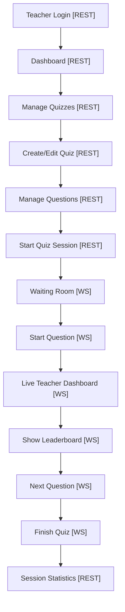
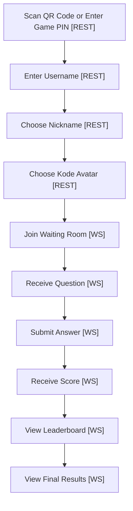
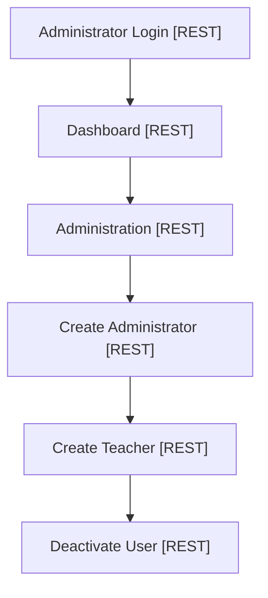
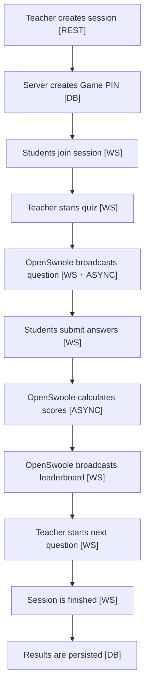
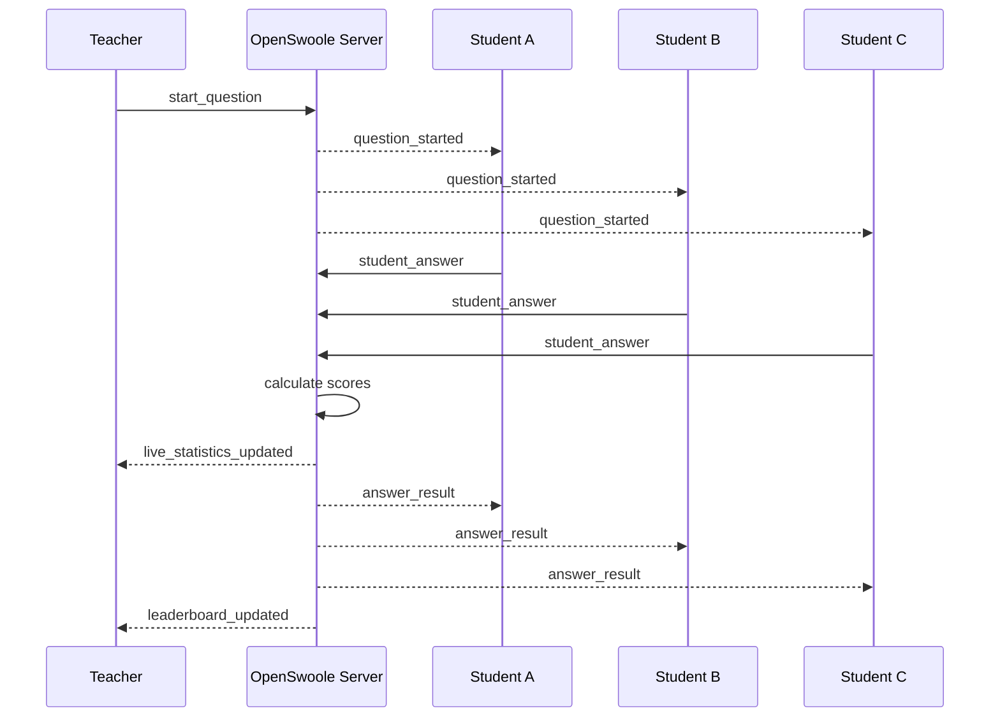
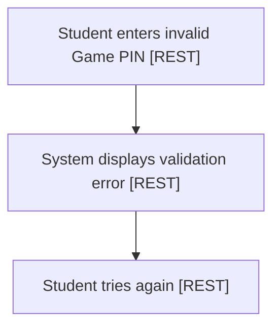
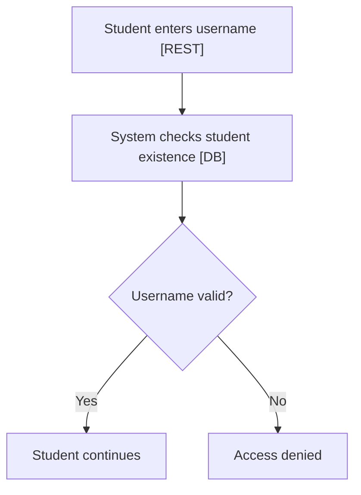
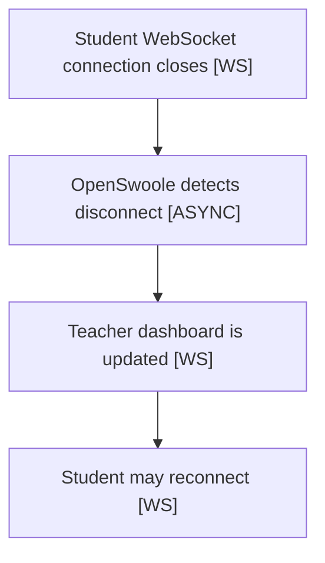

# User Flows

> Status: Draft  
> Version: 1.0  
> Project: CodeLand Quiz

## Purpose

This document describes the main user flows of the CodeLand Quiz platform.

The goal is to define how administrators, teachers, and students interact with the system before implementation begins.

The platform uses REST APIs for management operations and WebSockets for real-time quiz communication.

## Communication Types

| Type | Description |
| --- | --- |
| REST | HTTP REST API |
| WS | WebSocket communication |
| DB | Database operation |
| ASYNC | OpenSwoole internal asynchronous processing |

## Teacher Flow

## Student Flow

## Administrator Flow

## Quiz Session Flow

## Real-Time Communication Flow

## Error Flows

### Invalid Game PIN

### Invalid Student Username

### Student Disconnects

## Dashboard Modes

### Classroom Mode

Classroom Mode is the default teacher dashboard mode.

It displays:

- connected students;
- submitted answers;
- pending answers;
- countdown timer;
- leaderboard;
- connection warnings.

### Developer Mode

Developer Mode is available only to administrators.

It may display:

- active WebSocket connections;
- server uptime;
- memory usage;
- recent WebSocket events;
- average latency.

Developer Mode is used for technical monitoring and thesis demonstration.

## Key Design Decision

The platform uses REST APIs for actions that happen once, such as login, quiz creation, question management, and viewing statistics.

The platform uses WebSocket communication for actions that require real-time updates, such as joining a live session, broadcasting questions, submitting answers, updating the leaderboard, and monitoring live classroom state.
