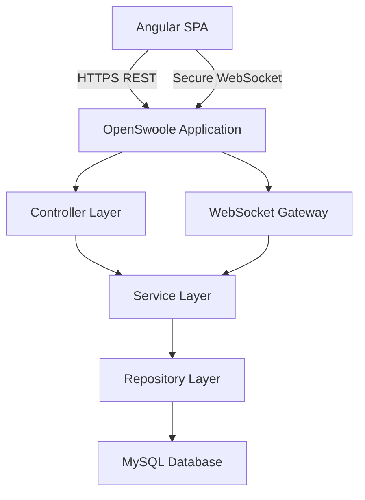
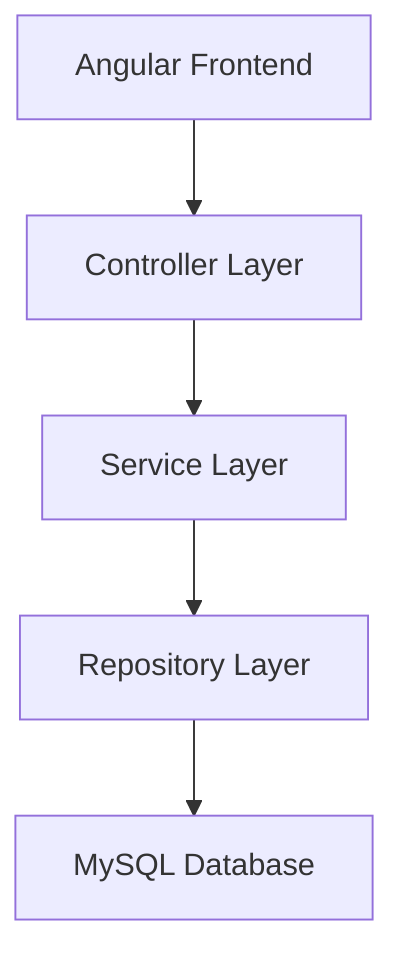
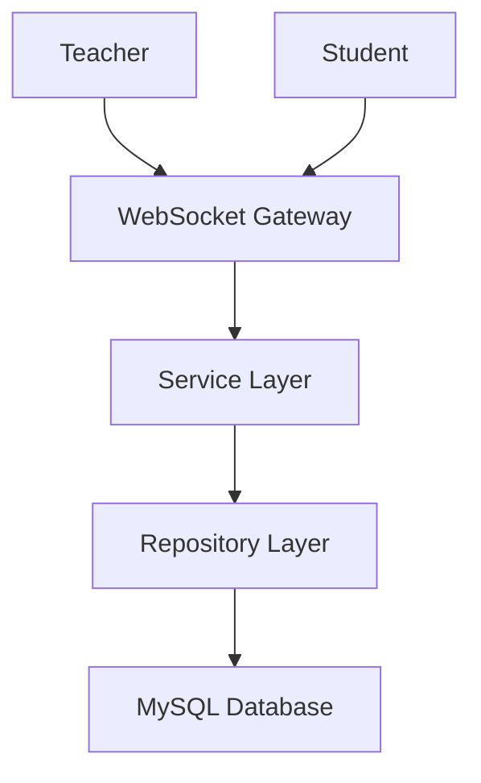
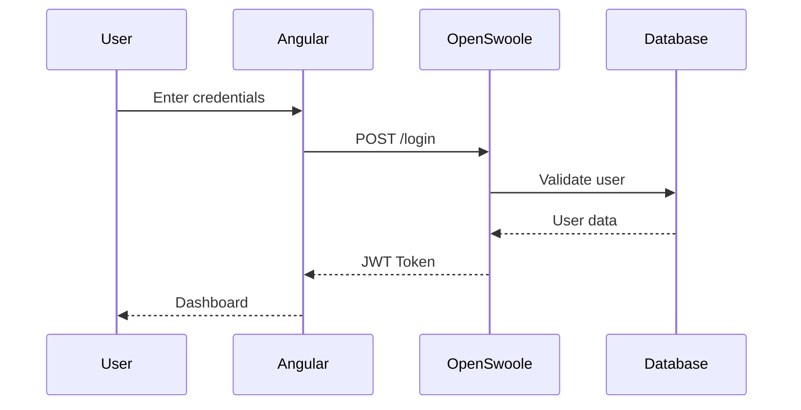
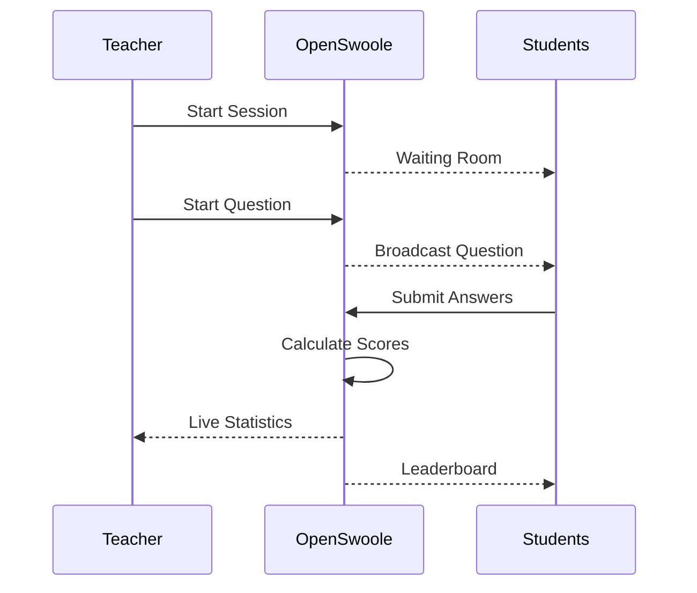

# System Architecture

> Status: Draft  
> Version: 1.0  
> Project: CodeLand Quiz

---

## Purpose

This document describes the overall software architecture of the CodeLand Quiz platform.

The application is designed as a real-time quiz platform that combines REST APIs and asynchronous WebSocket communication using a single OpenSwoole server.

---

## Architectural Overview



---

## System Components

### Angular Frontend

The Angular application provides the graphical user interface for all platform users.

Responsibilities:

- authentication;
- administrator dashboard;
- teacher dashboard;
- student interface;
- quiz management;
- quiz participation;
- WebSocket communication.

### OpenSwoole Application

The backend is implemented as a long-running OpenSwoole application.

Responsibilities:

- HTTP server;
- REST API;
- WebSocket server;
- authentication;
- authorization;
- quiz management;
- session management;
- score calculation;
- leaderboard updates.

Unlike traditional PHP applications, the server process remains active and maintains WebSocket connections during the entire quiz session.

### MySQL Database

The relational database stores all persistent application data.

Main entities include:

- administrators;
- teachers;
- students;
- quizzes;
- questions;
- answers;
- quiz sessions;
- statistics.

---

## Layered Architecture

The backend follows a layered architecture.



Business logic is implemented only inside the Service Layer.

---

## WebSocket Processing Architecture

Real-time communication bypasses the Controller Layer.



This architecture prevents duplication of business logic because both REST endpoints and WebSocket events use the same Service Layer.

---

## Backend Directory Structure

```text
backend/

app/
│
├── Controller/
├── DTO/
├── Middleware/
├── Model/
├── Repository/
├── Service/
├── Support/
└── WebSocket/
│
config/
database/
public/
storage/
tests/
vendor/
```

---

## Controller Layer

Responsibilities:

- receive HTTP requests;
- validate request format;
- call business services;
- generate HTTP responses.

Controllers must not contain business logic.

---

## Service Layer

The Service Layer contains all application business logic.

Examples include:

- authentication;
- quiz management;
- session management;
- leaderboard calculation;
- statistics generation.

Both REST controllers and WebSocket handlers use the same services.

---

## Repository Layer

Repositories isolate database operations from business logic.

Responsibilities:

- SQL queries;
- CRUD operations;
- transaction handling.

---

## Domain Models

Models represent business entities stored inside the database.

Examples:

- User
- Student
- Quiz
- Question
- QuizSession
- Answer

---

## Data Transfer Objects

DTO objects transfer validated data between application layers.

DTOs prevent exposing internal database models directly.

---

## Middleware Layer

Middleware executes before controllers.

Responsibilities include:

- JWT authentication;
- role validation;
- rate limiting;
- request validation;
- security headers.

---

## WebSocket Gateway

The WebSocket Gateway manages all real-time communication.

Responsibilities:

- connection management;
- room management;
- event broadcasting;
- reconnect handling;
- heartbeat monitoring.

---

## Support Layer

Contains helper classes shared across the application.

Examples:

- configuration;
- utilities;
- constants;
- helper functions.

---

## REST Communication

REST endpoints are used for operations executed once.

Examples include:

- login;
- administrator management;
- teacher management;
- student management;
- quiz CRUD;
- question CRUD;
- statistics retrieval.

---

## Real-Time Communication

WebSocket communication is used for operations requiring immediate updates.

Examples include:

- waiting room;
- student join notifications;
- question broadcasting;
- answer submission;
- countdown synchronization;
- leaderboard updates;
- teacher dashboard updates.

---

## Authentication Sequence



---

## Quiz Session Sequence



---

## Technology Decisions

### Why OpenSwoole?

OpenSwoole was selected because it supports:

- asynchronous programming;
- coroutine-based concurrency;
- long-running PHP processes;
- integrated HTTP and WebSocket servers.

These features make it suitable for real-time educational applications.

### Why Angular?

Angular was selected because it provides:

- component-based architecture;
- TypeScript support;
- reactive programming;
- scalable frontend development.

### Why Docker?

Docker provides:

- reproducible development environments;
- simplified deployment;
- container isolation.

### Why MySQL?

MySQL was selected because it offers reliable relational storage suitable for quiz data.

---

## Security Architecture

The platform will implement:

- HTTPS communication;
- JWT authentication;
- password hashing using bcrypt;
- role-based access control;
- request validation;
- secure file uploads.

A detailed description will be provided in the Security document.

---

## Future Extensions

The architecture supports future expansion, including:

- multiple classrooms;
- multiple simultaneous quiz sessions;
- quiz categories;
- AI-assisted quiz generation;
- parent portal;
- notifications.

---

## Related Documents

- Project Specification
- User Flows
- Use Cases
- Database Design
- REST API
- WebSocket Events
- Security
- Deployment
  