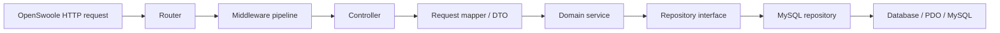
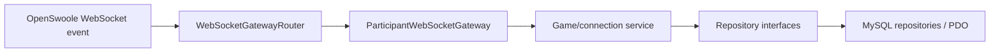
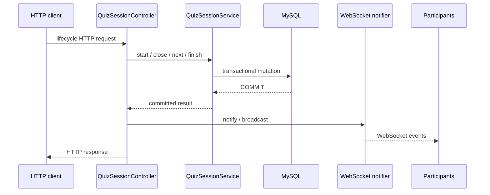

# System architecture

> Status: Implemented

## Technology and runtime

The backend uses PHP 8.3, OpenSwoole 26, MySQL 8.4, native PDO prepared statements, Composer and Docker. Angular is the planned frontend and is not part of the current implementation.

`backend/server.php` loads Composer, enables `OpenSwoole\Runtime::HOOK_ALL`, then starts `Application`. The long-running OpenSwoole server registers HTTP and WebSocket callbacks once. It runs with `worker_num = 1` and `enable_coroutine = true`.

## Request paths

```mermaid
flowchart LR
    H[OpenSwoole HTTP request] --> R[Router]
    R --> M[Middleware pipeline]
    M --> C[Controller]
    C --> D[Request mapper / DTO]
    D --> S[Domain service]
    S --> I[Repository interface]
    I --> MR[MySQL repository]
    MR --> DB[Database / PDO / MySQL]
```

Controllers translate HTTP concerns and exceptions; services own business rules; repositories isolate persistence. DTOs carry commands/results, while overview models represent persistence projections. Dependencies are assembled manually in `Bootstrap/ApplicationFactory.php`; no service container is used.

```mermaid
flowchart LR
    W[OpenSwoole WebSocket event] --> WR[WebSocketGatewayRouter]
    WR --> PG[ParticipantWebSocketGateway]
    PG --> GS[Game/connection service]
    GS --> RI[Repository interfaces]
    RI --> MYSQL[MySQL repositories / PDO]
```

Teacher lifecycle commands use HTTP. Their service transaction commits before the controller invokes a notifier:

```mermaid
sequenceDiagram
    participant C as HTTP client
    participant HC as QuizSessionController
    participant S as QuizSessionService
    participant DB as MySQL
    participant N as WebSocket notifier
    participant P as Participants
    C->>HC: lifecycle HTTP request
    HC->>S: start / close / next / finish
    S->>DB: transactional mutation
    DB-->>S: COMMIT
    S-->>HC: committed result
    HC->>N: notify / broadcast
    N-->>P: WebSocket events
    HC-->>C: HTTP response
```

Notification after commit prevents clients from observing an event whose database state could still roll back.

## Source layout

`backend/src/` contains `Admin`, `Auth`, `Bootstrap`, `Config`, `Controller`, `DTO`, `Game`, `Http`, `Middleware`, `Model`, `Question`, `Quiz`, `QuizSession`, `Repository`, `Student`, `Support`, `Topic`, and `WebSocket`. Domain services live in their corresponding domain folders; transport controllers are centralized in `Controller` with request mappers also present in domain `Http` folders.

## Concurrency

Runtime hooks allow blocking-compatible native PDO/MySQL I/O to yield. `Database` stores one lazy PDO connection in the current coroutine context; repeated repository and transaction-manager calls in that coroutine receive the identical PDO. Non-coroutine execution uses a lazy fallback connection.

The single worker is intentional because `ParticipantConnectionRegistry` is in-memory, worker-local state. Current locks follow a stable order:

- join: session `FOR SHARE`, then registered student row when applicable, then participant insert;
- answer: session `FOR SHARE`, then participant `FOR UPDATE`;
- participant authenticate/disconnect: session `FOR SHARE`, then participant `FOR UPDATE`;
- lifecycle: session `FOR UPDATE`;
- removal: session `FOR UPDATE`, then participant `FOR UPDATE`.

If an answer obtains its shared lock before close, close waits and includes it. If close commits first, the later answer sees closed state and is rejected. Join and start have the analogous outcome.

## Reconnection

One participant has one current socket mapping. A new authenticated socket replaces the mapping before the old socket is disconnected; the old close callback therefore cannot mark the new connection disconnected. Pending authentication uses a connection ID, including the 10-second timeout. Reconnection state is assembled under the session shared lock and supports WAITING, ACTIVE/open, ACTIVE/closed and FINISHED states.

## Future scalability

Multiple workers require shared WebSocket connection/session state, for example Redis, plus cross-worker delivery. A bounded database connection pool may later limit concurrent PDO connections. These are future improvements, not current components.
