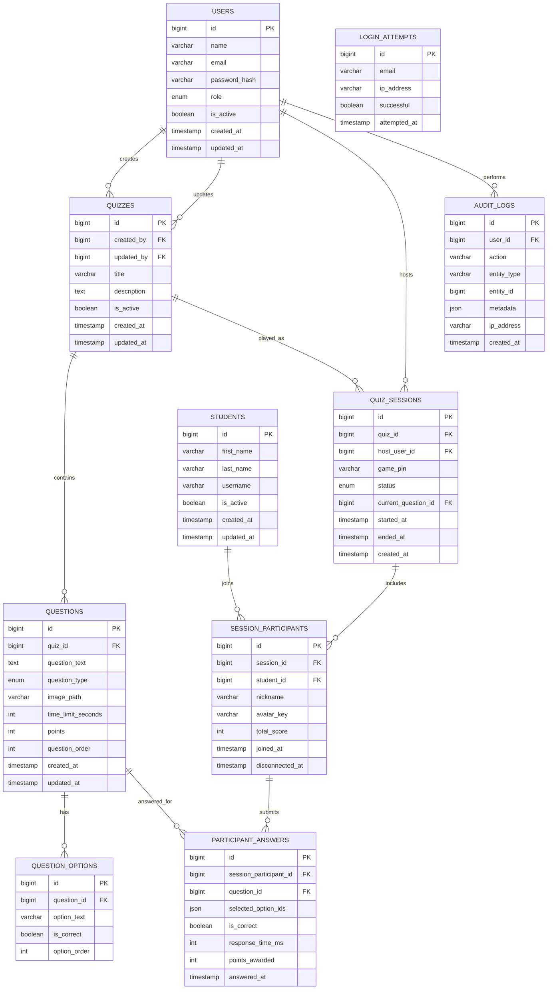

# Database Design

> Status: Draft  
> Version: 1.0  
> Project: CodeLand Quiz

---

## Purpose

This document describes the database design of the CodeLand Quiz platform.

The database is designed to support user management, student management, quiz creation, real-time quiz sessions, answer tracking, scoring, statistics, login protection, and audit logging.

---

## Design Goals

The database design follows these goals:

- separate authenticated users from students;
- support administrator and teacher accounts;
- allow only registered students to join quiz sessions;
- store quiz definitions separately from quiz sessions;
- preserve historical results after each played session;
- track who created and updated important records;
- support login attempt limiting;
- support audit logging;
- avoid storing images as BLOB values.

---

## Entity Relationship Diagram



---

## Tables Overview

| Table | Purpose |
| --- | --- |
| `users` | Stores administrator and teacher accounts. |
| `students` | Stores student profiles used for quiz participation. |
| `quizzes` | Stores quiz definitions. |
| `questions` | Stores quiz questions. |
| `question_options` | Stores answer options for each question. |
| `quiz_sessions` | Stores individual quiz play sessions. |
| `session_participants` | Stores students who joined a session. |
| `participant_answers` | Stores submitted answers and awarded points. |
| `login_attempts` | Stores login attempts for rate limiting and security. |
| `audit_logs` | Stores important user actions for traceability. |

---

## Users Table

The `users` table stores authenticated platform users.

This includes:

- administrators;
- teachers.

Students are intentionally stored in a separate table because they do not use traditional email and password authentication.

Main fields:

| Column | Description |
| --- | --- |
| `id` | Primary key. |
| `name` | Full display name. |
| `email` | Unique login email. |
| `password_hash` | Hashed password. |
| `role` | User role: `ADMIN` or `TEACHER`. |
| `is_active` | Indicates whether the account is active. |
| `created_at` | Creation timestamp. |
| `updated_at` | Last update timestamp. |

---

## Students Table

The `students` table stores students who are allowed to participate in quizzes.

Students do not have a normal login account. Instead, they join a quiz session using:

- Game PIN;
- username;
- nickname;
- Kode avatar.

Main fields:

| Column | Description |
| --- | --- |
| `id` | Primary key. |
| `first_name` | Student first name. |
| `last_name` | Student last name. |
| `username` | Unique student username. |
| `is_active` | Indicates whether the student may join sessions. |
| `created_at` | Creation timestamp. |
| `updated_at` | Last update timestamp. |

---

## Quizzes Table

The `quizzes` table stores quiz definitions.

A quiz can be played multiple times through different quiz sessions.

Main fields:

| Column | Description |
| --- | --- |
| `id` | Primary key. |
| `created_by` | User who created the quiz. |
| `updated_by` | User who last updated the quiz. |
| `title` | Quiz title. |
| `description` | Optional quiz description. |
| `is_active` | Indicates whether the quiz is available. |
| `created_at` | Creation timestamp. |
| `updated_at` | Last update timestamp. |

---

## Questions Table

The `questions` table stores questions that belong to a quiz.

Each question has:

- text;
- type;
- optional image;
- time limit;
- maximum points;
- order inside the quiz.

Supported question types:

- `TRUE_FALSE`
- `SINGLE_CHOICE`
- `MULTIPLE_CHOICE`

The `image_path` column stores a file path, not a BLOB value.

---

## Question Options Table

The `question_options` table stores possible answers for each question.

Each question contains four answer options.

Main fields:

| Column | Description |
| --- | --- |
| `id` | Primary key. |
| `question_id` | Related question. |
| `option_text` | Answer text. |
| `is_correct` | Indicates whether the option is correct. |
| `option_order` | Display order. |

---

## Quiz Sessions Table

The `quiz_sessions` table represents one live playing of a quiz.

A single quiz can have many sessions.

Main fields:

| Column | Description |
| --- | --- |
| `id` | Primary key. |
| `quiz_id` | Quiz being played. |
| `host_user_id` | Teacher or administrator hosting the session. |
| `game_pin` | Numeric Game PIN used by students to join. |
| `status` | `WAITING`, `ACTIVE`, or `FINISHED`. |
| `current_question_id` | Currently active question. |
| `started_at` | Session start timestamp. |
| `ended_at` | Session end timestamp. |
| `created_at` | Creation timestamp. |

---

## Session Participants Table

The `session_participants` table stores students who joined a specific quiz session.

The table stores the nickname and avatar selected for that session.

Main fields:

| Column | Description |
| --- | --- |
| `id` | Primary key. |
| `session_id` | Related quiz session. |
| `student_id` | Registered student. |
| `nickname` | Nickname used in the session. |
| `avatar_key` | Selected Kode avatar. |
| `total_score` | Total score in the session. |
| `joined_at` | Join timestamp. |
| `disconnected_at` | Optional disconnect timestamp. |

---

## Participant Answers Table

The `participant_answers` table stores answers submitted by students.

Main fields:

| Column | Description |
| --- | --- |
| `id` | Primary key. |
| `session_participant_id` | Student participation record. |
| `question_id` | Related question. |
| `selected_option_ids` | Selected answers stored as JSON. |
| `is_correct` | Whether the answer was correct. |
| `response_time_ms` | Response time in milliseconds. |
| `points_awarded` | Points awarded for the answer. |
| `answered_at` | Answer timestamp. |

---

## Login Attempts Table

The `login_attempts` table stores login attempts.

It supports protection against brute-force login attacks.

Main fields:

| Column | Description |
| --- | --- |
| `id` | Primary key. |
| `email` | Attempted login email. |
| `ip_address` | IP address of the client. |
| `successful` | Whether the attempt was successful. |
| `attempted_at` | Attempt timestamp. |

The application can use this table to block login temporarily after too many failed attempts.

---

## Audit Logs Table

The `audit_logs` table stores important user actions.

Examples:

- successful login;
- failed login;
- password change;
- quiz creation;
- quiz update;
- quiz deletion;
- session start;
- session finish.

Main fields:

| Column | Description |
| --- | --- |
| `id` | Primary key. |
| `user_id` | User who performed the action. |
| `action` | Action name. |
| `entity_type` | Type of affected entity. |
| `entity_id` | ID of affected entity. |
| `metadata` | Additional JSON data. |
| `ip_address` | Client IP address. |
| `created_at` | Action timestamp. |

---

## Image Storage Decision

Images are not stored as BLOB values in the database.

Instead, uploaded question images are stored in the application storage directory, while the database stores only the image path.

Example:

```text
storage/uploads/questions/question_123.png
```

Database value:

```text
uploads/questions/question_123.png
```

This approach keeps the database smaller and makes image serving and backup easier.

---

## Real-Time State Decision

The current state of an active quiz session is not fully stored in the database.

Examples of real-time state:

- active WebSocket connections;
- currently connected students;
- temporary countdown state;
- live classroom status.

This state is managed in memory by the OpenSwoole server.

The database stores persistent data such as:

- quiz definitions;
- participants;
- submitted answers;
- final scores;
- completed session history.

This decision demonstrates one of the main differences between a traditional request-response PHP application and a long-running asynchronous OpenSwoole application.

---

## Key Design Decisions

### Separate Users and Students

Administrators and teachers use traditional authentication with email and password.

Students only participate in quiz sessions and do not need a full account with password-based login.

This is why `users` and `students` are modeled separately.

### Store Image Paths Instead of BLOB Values

Question images are stored as files, while only paths are stored in the database.

This improves performance and simplifies application storage.

### Use Audit Logs for Traceability

Audit logs allow the system to track important actions.

This is useful for security, debugging, and future administration features.

### Store Answer Scores

The calculated score is stored in `participant_answers`.

This avoids recalculating historical results every time session statistics are viewed.

### Keep Live Session State in Memory

OpenSwoole keeps live connection state in memory during a running session.

This allows fast real-time communication and avoids unnecessary database writes.

---

## Related Documents

- Project Specification
- User Flows
- Use Cases
- System Architecture
- REST API
- WebSocket Events
- Security
  