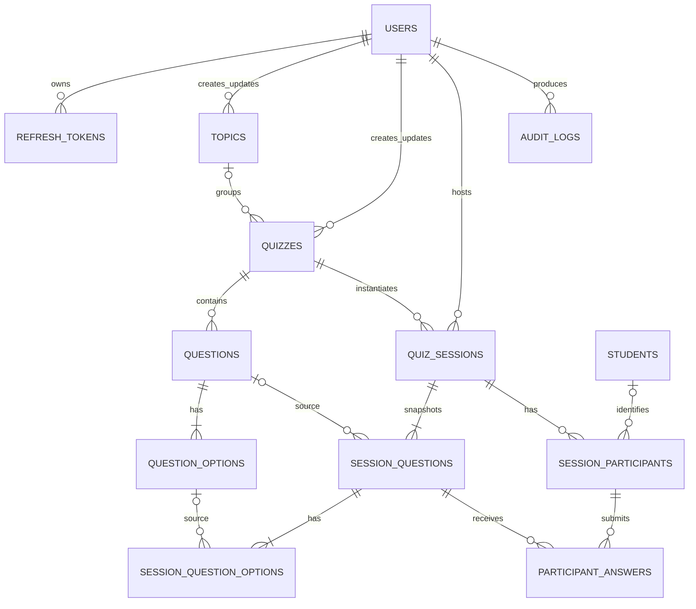

# Database design

> Status: Implemented

MySQL 8.4 uses InnoDB and `utf8mb4_unicode_ci`. The authoritative definition is `docker/mysql/init/001_schema.sql`.

## ER overview

```mermaid
erDiagram
    USERS ||--o{ REFRESH_TOKENS : owns
    USERS ||--o{ TOPICS : creates_updates
    USERS ||--o{ QUIZZES : creates_updates
    USERS ||--o{ QUIZ_SESSIONS : hosts
    USERS ||--o{ AUDIT_LOGS : produces
    TOPICS o|--o{ QUIZZES : groups
    QUIZZES ||--o{ QUESTIONS : contains
    QUESTIONS ||--|{ QUESTION_OPTIONS : has
    QUIZZES ||--o{ QUIZ_SESSIONS : instantiates
    QUIZ_SESSIONS ||--|{ SESSION_QUESTIONS : snapshots
    QUESTIONS o|--o{ SESSION_QUESTIONS : source
    SESSION_QUESTIONS ||--|{ SESSION_QUESTION_OPTIONS : has
    QUESTION_OPTIONS o|--o{ SESSION_QUESTION_OPTIONS : source
    QUIZ_SESSIONS ||--o{ SESSION_PARTICIPANTS : has
    STUDENTS o|--o{ SESSION_PARTICIPANTS : identifies
    SESSION_PARTICIPANTS ||--o{ PARTICIPANT_ANSWERS : submits
    SESSION_QUESTIONS ||--o{ PARTICIPANT_ANSWERS : receives
```

## Tables

- `users`: staff name, email, password hash, `must_change_password`, `ADMIN`/`TEACHER`, active/deleted flags and timestamps. Soft deletion preserves references.
- `refresh_tokens`: user, HMAC token hash, expiry, revocation, replacement link and creation time. Self-reference records rotation.
- `students`: first/last name, unique username, active/deleted lifecycle and timestamps. Students are not staff accounts.
- `topics`: shared name/description plus creator/updater and timestamps.
- `quizzes`: optional topic, creator/updater, title, version, description, activation, soft deletion and timestamps. Title/version uniqueness is enforced by a schema index.
- `questions`: quiz, text/type, optional image path, 30–300-second limit, 1–10000 points, order and soft deletion. Generated `active_question_order` makes ordering unique only for non-deleted questions.
- `question_options`: option text, correctness and order under a question.
- `quiz_sessions`: source quiz and host; snapshot `quiz_title`/`quiz_version`; PIN; `WAITING`/`ACTIVE`/`FINISHED`; generated `active_game_pin`; current question order/timing, join/start/end timestamps.
- `session_questions`: immutable question snapshots with nullable `source_question_id`, content, type, timing, points and order.
- `session_question_options`: immutable option snapshots with nullable `source_option_id`, text, correctness and order.
- `session_participants`: session, `REGISTERED`/`GUEST`, nullable student, nickname/avatar, score, connection state, logical removal and join time. Generated `active_student_id` and `active_nickname` become NULL after removal.
- `participant_answers`: participant, snapshot question, selected snapshot option IDs as JSON, correctness, response time, awarded points and answer time. Unique participant/question key permits one answer.
- `login_attempts`: email, success flag, optional user agent and attempt timestamp. There is no IP-address column.
- `audit_logs`: optional staff user, action, optional entity type/ID, optional JSON metadata and creation time. There is no IP-address column.

## Snapshots and JSON answers

Session snapshot rows protect historical reports from later edits or deletion of source content. Source foreign keys may become NULL while snapshot values remain. `selected_option_ids` is JSON because an answer contains a variable-size set (one or several IDs depending on question type); validation and foreign-session consistency are enforced by application logic while the answer row remains compact.

## Important indexes

- `idx_login_attempts_email_success_time (email, successful, attempted_at)` supports rate-limit counting.
- `idx_quiz_sessions_quiz_status_created (quiz_id, status, created_at, id)` supports history/statistics.
- `idx_session_participants_student_statistics (student_id, participant_type, is_removed, session_id)` supports long-term student statistics.
- `uq_session_participants_active_student` and `uq_session_participants_active_nickname` use generated columns to protect active joins while permitting logically removed identities to rejoin.
- Active game PIN and active question-order generated-column indexes enforce lifecycle-specific uniqueness.

Foreign keys preserve the implemented ownership/snapshot relationships; cascading is used for dependent content, while nullable source snapshot references use `ON DELETE SET NULL`.

## Time zone

PHP starts in UTC, MySQL defaults new sessions to UTC, and each newly created PDO connection executes `SET SESSION time_zone = '+00:00'`. Stored and compared timestamps therefore use UTC; API presentation uses ISO-8601 where mapped.
